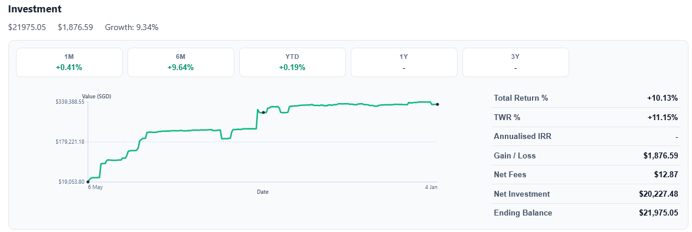
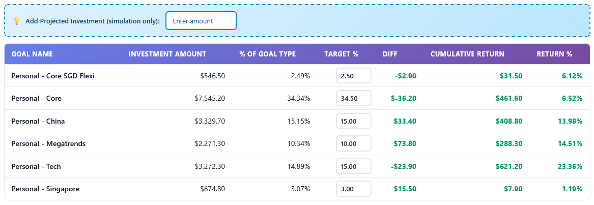

# Goal Portfolio Viewer

**Track core-satellite portfolios the way they were meant to be seen — clean, goal-aware, and entirely private.**

Investing today often means buying individual funds or managed funds across multiple goals. Most platforms still do not provide an easy way to visualize each of these purchases or track allocation across all of them, whether you follow core-satellite or a broader asset allocation framework. This userscript helps you spot imbalances early and organize everything around your real-life goals.

> **Platform Support**: Currently works with Endowus (Singapore). This userscript enhances your portfolio visualization experience by organizing goals into custom buckets.

---

## Core-Satellite Portfolio Tracking, Done Right

Goal Portfolio Viewer is built for investors who structure their wealth with intention. Whether you run a classic core-satellite strategy or a disciplined asset allocation plan, this userscript turns your portfolio dashboard into a purpose-first view of your portfolio.

It groups your goals by real-life outcomes — retirement, education, emergency funds, or any other life milestone — so you can see how each goal maps to your core and satellite holdings at a glance. Different goals naturally come with different timelines and risk tolerances, and this view helps you reflect those differences in how you allocate your portfolio.

---

## Asset Allocation Frameworks and Core-Satellite Strategies

A strong asset allocation framework makes sure your portfolio matches your time horizon and risk tolerance. Near-term goals often prioritize stability and liquidity, while long-term goals can take on more growth-oriented allocations. Seeing everything by goal makes it easier to keep each allocation aligned with its purpose.

Core-satellite strategies complement this approach. The core anchors each goal with broadly diversified, long-term holdings, while satellites provide focused exposures or tactical tilts. When your goals are grouped clearly, you can spot whether each goal has the right balance between steady core positions and more targeted satellite positions.

---

## Support for Multiple Goals and Allocation Styles

- **Goal-based clarity:** Keep multiple goals organized without spreadsheets or manual rollups.
- **Core + satellite aligned:** See long-term core holdings and tactical satellites side-by-side within each life goal.
- **Asset allocation visibility:** CPF, SRS, and cash investments show together with clear return and growth indicators.
- **Privacy first:** All data stays on your device and is processed locally in the browser.
- **Zero friction:** Use the "Bucket Name - Description" naming pattern in your goal names and the script does the rest.

---

## Why This View Matters

Endowus and many other platforms already provides excellent low-cost investment options and thoughtfully designed thematic portfolios. The gap is in visualizing your portfolio using a core-satellite approach, especially when you are buying individual funds or managed funds across many goals. When each asset is tracked as its own goal, a multi-goal, core-satellite strategy quickly becomes a long list of goals without a clear allocation view.

This overlay brings those assets back together so more sophisticated retail investors can see how each goal balances core holdings with focused exposures. That means it is easier to track satellite tilts such as China, Tech, or custom thematic portfolios built with FundSmart, while keeping the overall allocation aligned to each life goal.

- **Purpose-led investing:** Every goal is tracked with its own core-satellite balance.
- **Better decisions faster:** Identify imbalances, underweight satellites, or overexposed cores within seconds.
- **Made for Singapore investors:** A clean overlay built around the local workflow and account types.

---

## Get Started in Minutes

1. [Install Tampermonkey](https://www.tampermonkey.net/) for your browser.
2. [Add the Goal Portfolio Viewer Script](https://raw.githubusercontent.com/laurenceputra/goal-portfolio-viewer/main/tampermonkey/goal_portfolio_viewer.user.js).
3. Log in to Endowus. If you see the 📊 button, you're all set.

Bring your core-satellite strategy to life with a view that aligns with how you actually invest.
