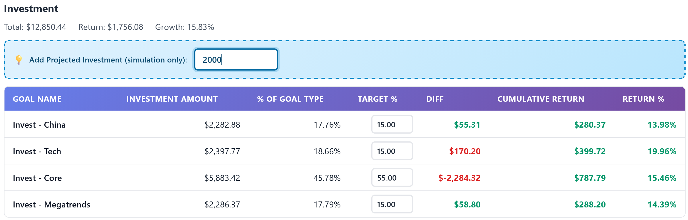

# Endowus Portfolio Viewer

**Track core-satellite portfolios the way they were meant to be seen — clean, goal-aware, and entirely private.**

---

## Core-Satellite Portfolio Tracking, Done Right

Endowus Portfolio Viewer is built for investors who structure their wealth with intention. Whether you run a classic core-satellite strategy or a disciplined asset allocation plan, this userscript turns your Endowus dashboard into a purpose-first view of your portfolio.

It groups your goals by real-life outcomes — retirement, education, emergency funds, or any other life milestone — so you can see how each goal maps to your core and satellite holdings at a glance. Different goals naturally come with different timelines and risk tolerances, and this view helps you reflect those differences in how you allocate your portfolio.

---

## Asset Allocation Frameworks and Core-Satellite Strategies

- **Buckets made easy:** See your holdings sorted by actual purpose, not just account type or product.
- **No more confusion:** CPF, SRS, and cash are tracked together. Color-coded growth and return stats make reading easy.
- **Modern, distraction-free view:** Gorgeous visual design fits right into your Endowus experience, without feeling bolted on.
- **Performance snapshots:** Responsive inline charts with dynamic height plus return windows surface recent momentum per goal type.
- **Privacy by default:** Your investment data stays on your device, processed locally in your browser. Nothing is shared or uploaded, ever.
- **Just works:** Install the script, log in to Endowus, and your portfolio is auto-organized if you use the "Bucket Name  -  Description" goal naming pattern. If not, it's just a quick rename.
A strong asset allocation framework makes sure your portfolio matches your time horizon and risk tolerance. Near-term goals often prioritize stability and liquidity, while long-term goals can take on more growth-oriented allocations. Seeing everything by goal makes it easier to keep each allocation aligned with its purpose.

Core-satellite strategies complement this approach. The core anchors each goal with broadly diversified, long-term holdings, while satellites provide focused exposures or tactical tilts. When your goals are grouped clearly, you can spot whether each goal has the right balance between steady core positions and more targeted satellite positions.

---

## Why This View Matters

Endowus already provides excellent low-cost investment options and thoughtfully designed thematic portfolios. The gap is in visualizing your portfolio using a core-satellite approach. When each asset is tracked as its own goal, a multi-goal, core-satellite strategy quickly becomes a long list of goals without a clear allocation view.

This overlay brings those assets back together so more sophisticated retail investors can see how each goal balances core holdings with focused exposures. That means it is easier to track satellite tilts such as China, Tech, or custom thematic portfolios built with FundSmart, while keeping the overall allocation aligned to each life goal.

- **Purpose-led investing:** Every goal is tracked with its own core-satellite balance.
- **Better decisions faster:** Identify imbalances, underweight satellites, or overexposed cores within seconds.
- **Made for Singapore investors:** A clean overlay built around Endowus' local workflow and account types.

---

## Get Started in Minutes

1. [Install Tampermonkey](https://www.tampermonkey.net/) for your browser.
2. [Add the Endowus Portfolio Viewer Script](https://raw.githubusercontent.com/laurenceputra/endowus_view_enhancer/main/tampermonkey/endowus_portfolio_viewer.user.js).
3. Log in to Endowus. If you see the 📊 button, you're all set.

Bring your core-satellite strategy to life with a view that aligns with how you actually invest.
